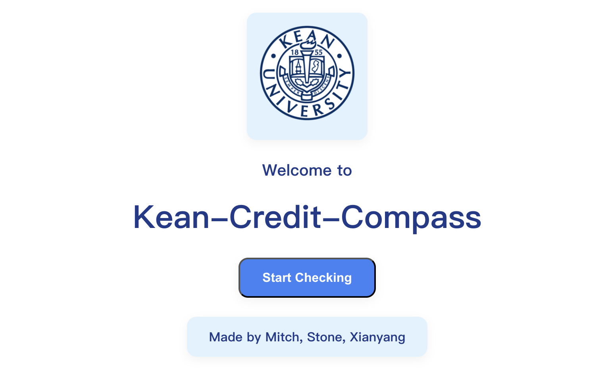
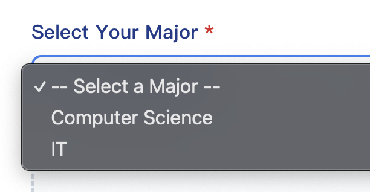
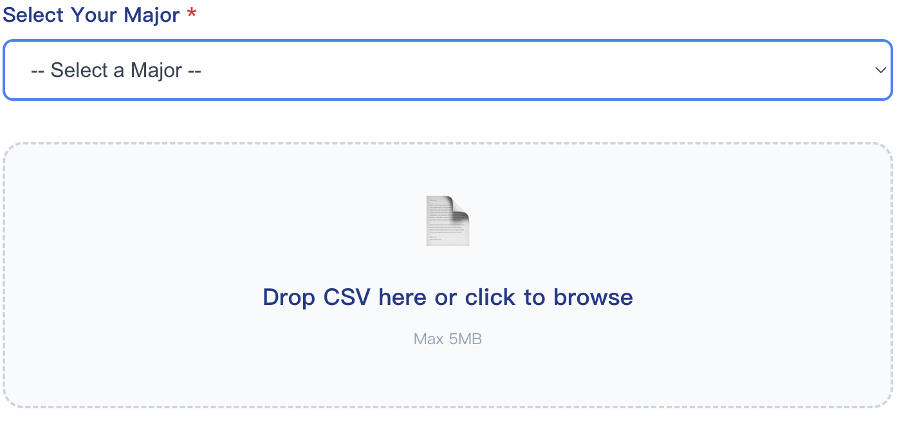
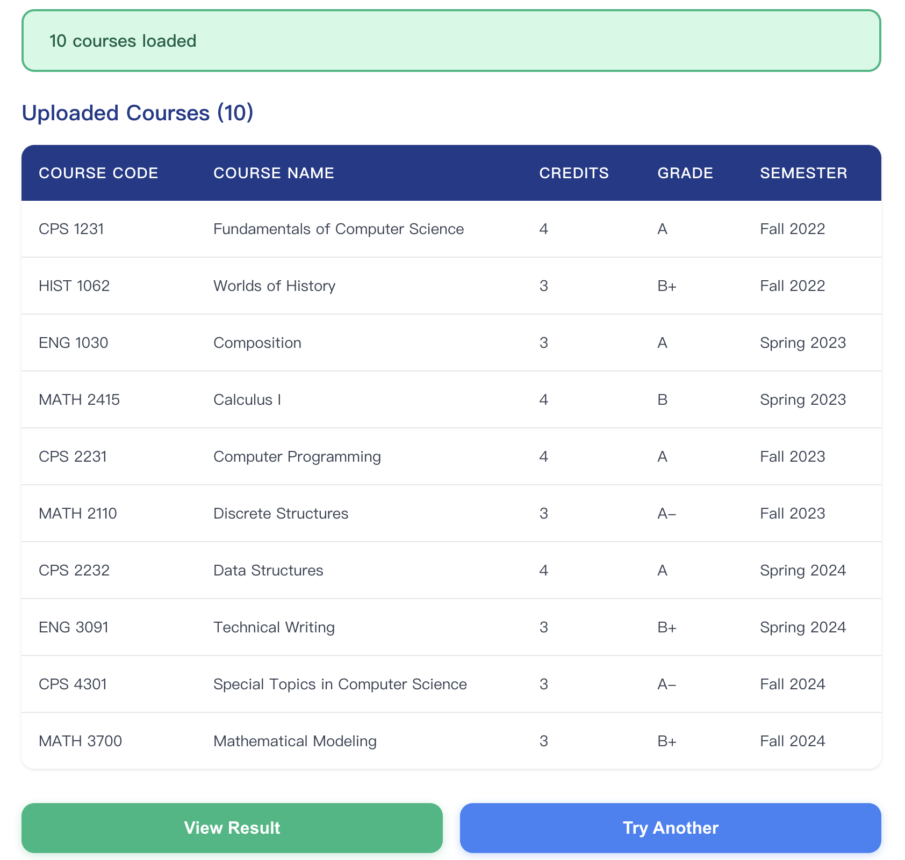
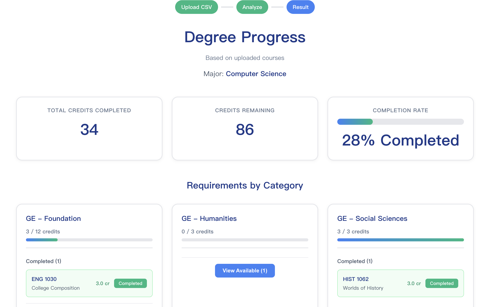
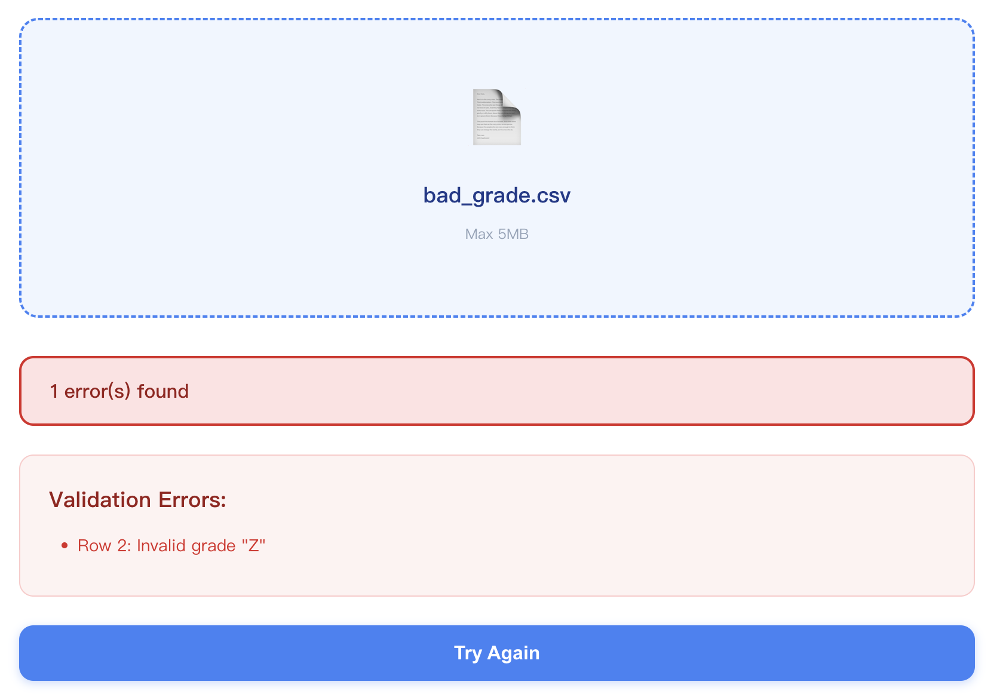

# User Manual - Kean Credit Compass

## 1. Installation & Deployment

### Technical Specifications

| Component | Requirement |
|-----------|-------------|
| Node.js | v18.0 or higher |
| npm | v6.0 or higher |
| Browser | Chrome, Firefox, Edge, or Safari (latest) |
| Internet | Required for API connection |
| OS | Windows, macOS, or Linux |

### Backend (Remote API)

The backend API is hosted at:
```
https://obi.kean.edu/~toranm@kean.edu
```

**Server Requirements (if self-hosting):**
- PHP 7.4+
- PDO MySQL extension
- Apache or Nginx web server

**Database:**
- MySQL server: imc.kean.edu
- Schema: 2025F_CPS4301_01

### Frontend Installation Steps

```bash
# Step 1: Clone the repository
git clone https://github.com/XuTeng-Stone/Kean-Credit-Compass.git

# Step 2: Navigate to frontend directory
cd Kean-Credit-Compass/kcc-frontend/my-app

# Step 3: Install dependencies
npm install

# Step 4: Start the application
npm start
```

The application will open at `http://localhost:3000`

### Production Deployment

```bash
# Build for production
npm run build

# Deploy the 'build' folder to any static hosting service:
# - Netlify
# - Vercel
# - GitHub Pages
```

---

## 2. Project Structure

### Directory Overview

```
Kean-Credit-Compass/
├── kcc-backend/                 # Backend API (PHP)
│   └── api/
│       ├── test.php            # Main API endpoint
│       └── kcc_table.php       # Database viewer
├── kcc-frontend/               # Frontend application
│   └── my-app/
│       ├── src/
│       │   ├── Pages/
│       │   │   ├── LandingPage.jsx    # Home page
│       │   │   ├── CourseUpload.jsx   # CSV upload & validation
│       │   │   └── DegreeProgress.jsx # Results display
│       │   ├── config.js              # API configuration
│       │   └── App.js                 # Main routing
│       └── public/
│           └── sample-courses.csv     # Example CSV file
├── auto-test/                  # End-to-End testing
│   ├── tests/
│   │   ├── common_flows.py     # Shared test utilities
│   │   └── test_*.py          # Individual test cases
│   ├── conftest.py            # Pytest configuration
│   └── data/
│       ├── valid.csv          # Valid test data
│       ├── bad_credits.csv    # Invalid credits test data
│       └── bad_grade.csv      # Invalid grades test data
├── data/                      # Additional test data
│   ├── valid.csv
│   ├── bad_credits.csv
│   └── bad_grade.csv
└── tests/                     # Legacy test directory
    ├── __init__.py
    ├── common_flows.py
    └── test_*.py
```

### Key Components

**Backend (kcc-backend/)**
- `test.php`: Main API handling degree requirement comparisons
- `kcc_table.php`: Database table viewer for development

**Frontend (kcc-frontend/my-app/)**
- `src/Pages/`: React components for different application screens
- `config.js`: API endpoint configuration
- `public/`: Static assets including sample CSV files

**Testing (auto-test/)**
- Selenium-based end-to-end tests
- Test data for various validation scenarios
- Automated test execution with pytest

---

## 3. Main Features

### Feature Overview

**Kean Credit Compass** is a web application designed for Kean University Computer Science and IT students to track their degree progress.

### Key Features

1. **CSV Course Upload**
   - Drag-and-drop file upload
   - Supports standard CSV format
   - Instant file validation

2. **Real-time Validation**
   - Checks required columns (Course Code, Course Name, Credits, Grade, Semester)
   - Validates grade format (A, A-, B+, B, B-, C+, C, C-, D, F)
   - Validates credit range (0-6)

3. **Degree Progress Tracking**
   - Tracks 120 total credits required for graduation
   - Shows completion percentage
   - Visual progress bars for each category

4. **Category Breakdown**
   - GE Foundation, Humanities, Social Sciences, Science & Math
   - Additional Required courses
   - Major Core and Concentration
   - Major Electives (CPS 3000+ level)
   - Capstone
   - Free Electives

5. **Smart Course Matching**
   - Automatically matches courses to requirements
   - Detects Major Electives (CPS courses at 3000+ level)
   - Detects Free Electives (non-CPS courses)
   - Prevents double-counting

6. **Expand/Collapse Views**
   - View available courses for each category
   - See which courses are completed vs remaining

---

## 3. Main Scenario Walkthrough

### Scenario: Checking Degree Progress for CS Major

**Goal:** Upload completed courses and view degree progress

#### Step 1: Open the Application
Navigate to `http://localhost:3000` in your browser.


- You will see the landing page with "Start Checking" button

#### Step 2: Click "Start Checking"
Click the button to proceed to the upload page.

#### Step 3: Select Your Major

- Click "Computer Science" or "IT" button
- The selected major will be highlighted

#### Step 4: Upload Your CSV File

- Drag your CSV file onto the upload zone, OR
- Click the upload zone to browse files

**CSV Format Required:**
```csv
Course Code,Course Name,Credits,Grade,Semester
CPS 1231,Fundamentals of Computer Science,4,A,Fall 2022
HIST 1062,Worlds of History,3,B+,Fall 2022
```

#### Step 5: Review Validation Results

- Success message shows number of courses loaded
- Preview table displays all uploaded courses
- If errors exist, they will be listed for correction

#### Step 6: Click "View Result"
Click the button to see your degree progress.

#### Step 7: View Progress Results

- **Top Section:** Total credits completed, remaining credits, completion percentage
- **Middle Section:** Category breakdown with progress bars
- **Bottom Section:** Full course list with circular chart

#### Step 8: Explore Categories
- Click "View Available" to expand any category
- See completed courses (with checkmarks) and remaining requirements
- Click again to collapse

---

## 5. Additional Scenarios

### Scenario A: Handling Invalid CSV File

**Goal:** Understand how the system handles validation errors

#### Step 1: Upload Invalid File
Upload a CSV with errors (missing columns, invalid grades, etc.)

#### Step 2: View Error Messages

- System displays specific error messages:
  - "Missing column: Credits"
  - "Row 3: Invalid grade 'X'"
  - "Row 5: Credits must be 0-6"

#### Step 3: Fix and Re-upload
- Click "Try Again"
- Correct the errors in your CSV file
- Upload the corrected file

---

### Scenario B: Checking IT Major Progress

**Goal:** Track progress for IT major instead of CS

#### Step 1: Select IT Major
- On the upload page, click "IT" instead of "Computer Science"

#### Step 2: Upload Courses
- Upload same CSV file with your completed courses

#### Step 3: View IT-Specific Requirements
> **Note:** IT major functionality is not yet implemented. Currently supports Computer Science major only.
- Categories will reflect BS-IT program requirements (planned)
- Different Major Core and Concentration courses (planned)
- Same GE requirements as CS

#### Step 4: Compare Requirements
- IT major has different concentration courses
- Major Electives may include IT-specific courses
- Total credits remain 120

---

### Scenario C: Using Sample CSV

**Goal:** Test the system with sample data

#### Step 1: Download Sample
- Click "Download Sample" link on upload page

#### Step 2: Review Sample Format
```csv
Course Code,Course Name,Credits,Grade,Semester
CPS 1231,Fundamentals of Computer Science,4,A,Fall 2022
HIST 1062,Worlds of History,3,B+,Fall 2022
ENG 1030,Composition,3,A,Spring 2023
MATH 2415,Calculus I,4,B,Spring 2023
```

#### Step 3: Upload and View Results
- Upload the sample file
- View how courses are categorized
- Use as template for your own course list

---

## 6. Automated Testing

### Testing Framework

**Kean Credit Compass** includes comprehensive automated testing using Selenium WebDriver and pytest to ensure application reliability and functionality.

### Prerequisites for Testing

| Component | Requirement |
|-----------|-------------|
| Python | 3.8+ |
| pytest | 6.0+ |
| Selenium | 4.0+ |
| ChromeDriver | Latest compatible version |
| Frontend | Must be running on http://localhost:3000 |

### Test Structure

**Test Files (`auto-test/tests/`)**
- `test_valid_upload.py`: Tests successful CSV upload and validation
- `test_invalid_credits.py`: Tests credit validation (0-6 range)
- `test_invalid_grade.py`: Tests grade validation (A, A-, B+, etc.)

**Test Data (`auto-test/data/`)**
- `valid.csv`: Valid course data for successful upload tests
- `bad_credits.csv`: Invalid credit values for validation testing
- `bad_grade.csv`: Invalid grade formats for validation testing

### Running Automated Tests

#### Setup Testing Environment

```bash
# Install Python dependencies (if not already installed)
pip install pytest selenium webdriver-manager

# Start the frontend application
cd kcc-frontend/my-app
npm start
# Frontend should be running on http://localhost:3000
```

#### Execute All Tests

```bash
# Navigate to test directory
cd auto-test

# Run all tests with verbose output
BASE_URL=http://localhost:3000 python -m pytest -v
```

#### Run Specific Test Files

```bash
# Test valid upload functionality
BASE_URL=http://localhost:3000 python -m pytest tests/test_valid_upload.py -v

# Test invalid credits validation
BASE_URL=http://localhost:3000 python -m pytest tests/test_invalid_credits.py -v

# Test invalid grades validation
BASE_URL=http://localhost:3000 python -m pytest tests/test_invalid_grade.py -v
```

### Test Scenarios Covered

1. **Valid Upload Flow**
   - Select major (Computer Science/IT)
   - Upload valid CSV file
   - Verify successful validation
   - Navigate to results page
   - Confirm progress calculation accuracy

2. **Invalid Credits Validation**
   - Upload CSV with credits outside 0-6 range
   - Verify appropriate error messages
   - Ensure upload is rejected

3. **Invalid Grades Validation**
   - Upload CSV with invalid grade formats
   - Verify grade validation errors
   - Confirm system rejects invalid grades

### Test Configuration

**conftest.py**: Contains pytest fixtures and setup
- Automatic Chrome WebDriver initialization
- Browser window maximization
- Automatic driver cleanup after tests

**Common Flows (common_flows.py)**
- Shared functions for common test operations
- Major selection utilities
- File upload helpers
- Navigation functions

### Troubleshooting Tests

**Common Issues:**
- **"Frontend not accessible"**: Ensure `npm start` is running on port 3000
- **"ChromeDriver not found"**: webdriver-manager should handle this automatically
- **"Test timeout"**: Check internet connection and API availability
- **"Element not found"**: UI changes may require test updates

**Debug Mode:**
```bash
# Run tests with detailed output
BASE_URL=http://localhost:3000 python -m pytest -v -s

# Run single test for debugging
BASE_URL=http://localhost:3000 python -m pytest tests/test_valid_upload.py::test_valid_csv_upload -v -s
```
